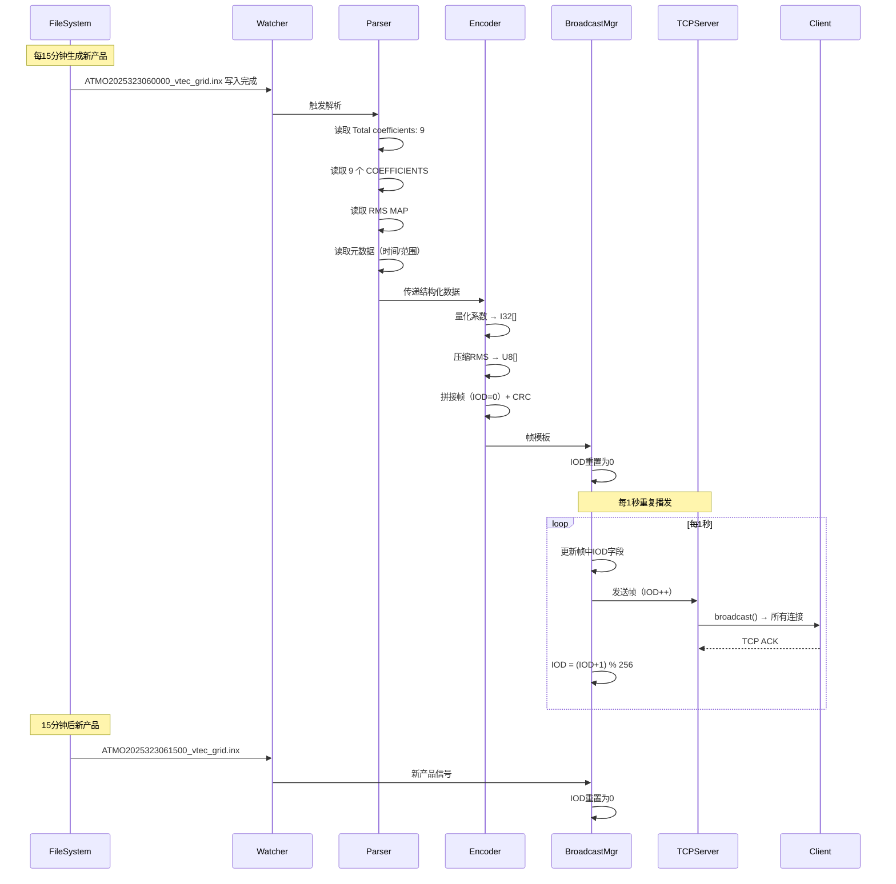

# 实时电离层模型播发系统设计文档 (RTVM-Broadcaster)

## 1. 项目概述

本系统旨在实时监控本地生成的 `.inx` 电离层产品文件（IONEX格式），提取**球谐系数**和**RMS精度格网**，按照特定的二进制协议打包成帧，通过 **TCP Server** 形式对外播发。支持 RTKLIB/str2str 等标准客户端接入。

**设计参考**：基于 RTKLIB `stream.c` 中 `tcpsvr_t` 的实现思路。

---

## 2. 模块化文件结构（简化版）

```
rtvm_broadcaster/
├── config/
│   └── bcast.json               # 配置文件（简化命名）
├── logs/
│   └── bcast.log                # 运行日志
├── src/
│   ├── __init__.py
│   ├── main.py                  # 主程序入口（100行内）
│   ├── parser.py                # INX 文件解析器（150行内）
│   ├── encoder.py               # 二进制协议编码器（200行内）
│   ├── tcpsvr.py                # TCP Server 实现（200行内）
│   ├── bcast.py                 # 播发管理器（IOD控制，100行内）
│   ├── watcher.py               # 文件监控模块（80行内）
│   └── tcpcmn.py                # 通用工具函数集合
│       # 包含：配置加载、时间转换、CRC、日志初始化
├── tests/
│   ├── test_parser.py
│   ├── test_encoder.py
│   └── test_data/
│       └── ATMO2025323060000_vtec_grid.inx
├── requirements.txt             # Python 依赖
└── README.md                    # 项目说明
```

### 模块职责说明（简化版）

| 模块 | 文件 | 核心函数 | 行数 |
|------|------|---------|------|
| **入口** | `main.py` | `main()` | ~100 |
| **通用** | `tcpcmn.py` | `load_cfg()`, `utc2gps()`, `crc16()`, `init_log()` | ~150 |
| **解析** | `parser.py` | `parse_inx()` → 返回结构化数据 | ~150 |
| **编码** | `encoder.py` | `encode_frame()` → 返回 bytes | ~200 |
| **网络** | `tcpsvr.py` | `TCPServer` 类（3个方法） | ~200 |
| **播发** | `bcast.py` | `Broadcaster` 类（IOD管理） | ~100 |
| **监控** | `watcher.py` | `watch_dir()` | ~80 |

### 命名规范

**原则**：简短、清晰、无歧义

| 类型 | 规范 | 示例 |
|------|------|------|
| 文件名 | 单词缩写，全小写 | `tcpsvr.py`, `bcast.py`, `tcpcmn.py` |
| 函数名 | 动词+名词，snake_case | `load_cfg()`, `parse_inx()`, `encode_frame()` |
| 类名 | 名词，PascalCase | `TCPServer`, `Broadcaster` |
| 变量名 | 名词，snake_case | `cfg`, `data`, `frame`, `iod` |
| 常量 | 全大写 | `MAX_CLI`, `FRAME_HEAD` |

**禁止**：
- ❌ `config_loader.py` → ✅ `tcpcmn.py`
- ❌ `broadcast_manager.py` → ✅ `bcast.py`
- ❌ `protocol_encoder.py` → ✅ `encoder.py`

---

## 3. 协议帧格式详解（与PDF文档严格对应）

### 3.1 完整帧结构

```
┌──────────────┬────────┬────────┬──────────────────────┐
│   帧头       │  帧体  │  帧尾  │                      │
│  (Header)    │ (Body) │ (Tail) │  说明                │
├──────────────┼────────┼────────┼──────────────────────┤
│ 帧头(2B)     │        │        │ 0x01AA (U16)         │
│ 消息ID(1B)   │        │        │ 0x02 (U8)            │
│ 帧长度(2B)   │        │        │ 总字节数 (U16)       │
│ 周计数(2B)   │        │        │ GPS Week (U16)       │
│ 周内秒(4B)   │        │        │ SOW×1000 (U32)       │
│ 建模间隔(1B) │        │        │ 分钟数 (U8)          │
│ IOD(1B)      │        │        │ 重复计数 (U8)        │
│              │ 参考高 │        │ 450 km (U16)         │
│              │ 半径   │        │ 6371 km (U16)        │
│              │ 模型   │        │ 0:SPH 1:GTS 2:POLY   │
│              │ 阶数NM │        │ 高4位N 低4位M (U8)   │
│              │ 系数K个│        │ 每个4字节 (I32[])    │
│              │ 格网定义│       │ 经纬度范围+间隔      │
│              │ RMS块  │        │ 压缩后字节流         │
│              │        │ 校验位 │ CRC-16 (U16)         │
│              │        │ 类型   │ 0x00FF (U16)         │
└──────────────┴────────┴────────┴──────────────────────┘
```

### 3.2 帧头字段（13 字节）

| 字段 | 偏移 | 字节数 | 类型 | 量化 | 说明 | Struct |
|------|------|--------|------|------|------|--------|
| **帧头** | 0 | 2 | U16 | - | 固定 `0x01AA` | `>H` |
| **消息ID** | 2 | 1 | U8 | - | `0x02`（区域电离层） | `B` |
| **帧长度** | 3 | 2 | U16 | - | 从帧头到帧尾总字节数 | `>H` |
| **周计数** | 5 | 2 | U16 | - | GPS Week | `>H` |
| **周内秒** | 7 | 4 | U32 | 0.001s | SOW × 1000 | `>I` |
| **建模间隔** | 11 | 1 | U8 | min | 配置值（如15分钟） | `B` |
| **IOD** | 12 | 1 | U8 | - | 重复播发计数（0-255循环） | `B` |

### 3.3 帧体字段（变长）

#### 3.3.1 模型参数段（6 字节）

| 字段 | 偏移 | 字节数 | 类型 | 量化 | 说明 | Struct |
|------|------|--------|------|------|------|--------|
| **模型参考高** | 13 | 2 | U16 | km | HGT1（如450） | `>H` |
| **地球半径** | 15 | 2 | U16 | km | BASE RADIUS（6371） | `>H` |
| **模型代号** | 17 | 1 | U8 | - | 0:SPH 1:GTS 2:POLY | `B` |
| **阶数N,M** | 18 | 1 | U8 | - | 高4位N 低4位M<br>如N=2,M=2 → 0x22 | `B` |

#### 3.3.2 系数列表段（4×K 字节）

| 字段 | 偏移 | 字节数 | 类型 | 量化 | 说明 | Struct |
|------|------|--------|------|------|------|--------|
| **系数列表** | 19 | 4×K | I32[] | 0.001 TECU | K从文件读取<br>每个系数 = int(val×1000) | `>i` (循环K次) |

**K值获取**：从 INX 文件头 `Total coefficients: 9` 中提取

**顺序**：按文件中顺序读取，不重排（双重循环：外层N，内层M）

#### 3.3.3 格网定义段（12 字节）

| 字段 | 偏移 | 字节数 | 类型 | 量化 | 说明 | Struct |
|------|------|--------|------|------|------|--------|
| **起始经度** | 19+4K | 2 | I16 | 0.1° | LON1 × 10 | `>h` |
| **起始纬度** | 21+4K | 2 | I16 | 0.1° | LAT1 × 10 | `>h` |
| **截止经度** | 23+4K | 2 | I16 | 0.1° | LON2 × 10 | `>h` |
| **截止纬度** | 25+4K | 2 | I16 | 0.1° | LAT2 × 10 | `>h` |
| **纬度间隔** | 27+4K | 1 | U8 | 0.1° | abs(DLAT) × 10 | `B` |
| **经度间隔** | 28+4K | 1 | U8 | 0.1° | abs(DLON) × 10 | `B` |
| **网格总数** | 29+4K | 2 | U16 | - | (纬度点数) × (经度点数) | `>H` |

**字段必要性**：
- ✅ **保留该字段**：这是很好的校验字段。虽然接收端可以通过 `(Lat1-Lat2)/Step` 算出点数，但显式传输一个总数可以让接收端验证："我算出来的格网大小和发送端说的大小是否一致？"如果不一致（比如浮点数计算误差导致少算一行），直接报错丢弃。

**计算示例**：
```python
n_lat = int(abs((55.0 - 25.0) / 1.0)) + 1  # 31
n_lon = int(abs((135.0 - 95.0) / 1.0)) + 1  # 41
grid_cnt = n_lat * n_lon  # 1271
```

#### 3.3.4 RMS 数据块（L 字节，L = ⌈网格总数/2⌉）

| 字段 | 偏移 | 字节数 | 类型 | 说明 |
|------|------|--------|------|------|
| **RMS索引** | 31+4K | L | U8[] | 每字节存2个点的4-bit索引 |

**压缩规则**（严格按PDF）：
- 每个字节包含**两个格网点**的 RMS 索引
- **高4位（Bit 7-4）**：前一个格网点（Point N）
- **低4位（Bit 3-0）**：后一个格网点（Point N+1）
- 若总点数为奇数，最后一个字节的低4位填充 `0xF`

**RMS值到索引映射**（0.1 TECU单位）：

| 索引 | RMS范围(TECU) | INX值范围(0.1TECU) |
|------|--------------|-------------------|
| 0 | [0.0, 0.6) | [0, 6) |
| 1 | [0.6, 1.2) | [6, 12) |
| 2 | [1.2, 1.8) | [12, 18) |
| 3 | [1.8, 2.4) | [18, 24) |
| 4 | [2.4, 3.0) | [24, 30) |
| 5 | [3.0, 3.6) | [30, 36) |
| 6 | [3.6, 4.2) | [36, 42) |
| 7 | [4.2, 4.8) | [42, 48) |
| 8 | [4.8, 5.4) | [48, 54) |
| 9 | [5.4, 6.0) | [54, 60) |
| 10 | [6.0, 6.6) | [60, 66) |
| 11 | [6.6, 7.2) | [66, 72) |
| 12 | [7.2, 7.8) | [72, 78) |
| 13 | [7.8, 8.4) | [78, 84) |
| 14 | [8.4, 9.0) | [84, 90) |
| 15 | ≥9.0 | ≥90 |

**格网点扫描顺序**（与IONEX一致）：
1. **优先按纬度递减**（从起始纬度到截止纬度）
2. **次级按经度递增**（从起始经度到截止经度）

示例：
```
55.0°纬度线（41个点）：95° 96° 97° ... 135°
54.0°纬度线（41个点）：95° 96° 97° ... 135°
...
25.0°纬度线（41个点）：95° 96° 97° ... 135°
```

### 3.4 帧尾字段（4 字节）

| 字段 | 偏移 | 字节数 | 类型 | 说明 | Struct |
|------|------|--------|------|------|--------|
| **校验位** | 31+4K+L | 2 | U16 | CRC-16/XMODEM<br>范围：从消息ID到校验位前 | `>H` |
| **类型标识** | 33+4K+L | 2 | U16 | 固定 `0x00FF` | `>H` |

**CRC计算范围**：
- 起始：消息ID（偏移2）
- 结束：校验位之前（偏移31+4K+L-1）

---

## 4. 数据源分析（INX 文件结构）

```
IONEX VERSION / TYPE
PGM / RUN BY / DATE
EPOCH OF FIRST MAP
EPOCH OF LAST MAP
INTERVAL
# OF MAPS IN FILE
MAPPING FUNCTION
COEFFICIENTS START
  Order: 2 x 2, Total coefficients: 9          ← 模型阶数 N=2, M=2
  MAP 1 COEF 2025 11 18 16 0 0                 ← 历元时间
    56468.4816 -31399.0356 -37379.3654 ...     ← 球谐系数（浮点TECU）
COEFFICIENTS END
ELEVATION CUTOFF
# OF SATELLITES
BASE RADIUS                                    ← 6371.0 km
HGT1 / HGT2 / DHGT                             ← 450.0 km（参考高）
LAT1 / LAT2 / DLAT                             ← 55.0 / 25.0 / -1.0
LON1 / LON2 / DLON                             ← 95.0 / 135.0 / 1.0

START OF TEC MAP                               ← 这部分不用（格网TEC值）
  [格网TEC数据...]
END OF TEC MAP

START OF RMS MAP                               ← **关键：精度格网**
  EPOCH OF CURRENT MAP
  55.0  95.0 135.0  1.0 450
    90 84 78 72 67 62 57 53 50 46 ...          ← RMS值（单位：0.1 TECU）
  54.0  95.0 135.0  1.0 450
    81 75 69 63 58 54 50 46 42 39 ...
  ...
END OF RMS MAP
```

---

---

## 5. tcpcmn.py 工具函数集合

**功能**：集中所有通用工具函数，避免模块碎片化。

```python
# tcpcmn.py - 通用工具函数

def load_cfg(path: str = "config/bcast.json") -> dict:
    """加载并校验配置文件"""
    pass

def utc2gps(dt: datetime) -> tuple[int, float]:
    """UTC时间转GPS Week/SOW (考虑闰秒)"""
    pass

def crc16(data: bytes) -> int:
    """CRC-16/XMODEM校验 (多项式0x1021)"""
    pass

def init_log(cfg: dict) -> logging.Logger:
    """初始化文件+控制台日志"""
    pass

def rms2idx(rms_01tecu: int) -> int:
    """RMS值(0.1TECU) → 4-bit索引 (0-15)"""
    pass
```

---

## 6. 核心模块设计

### 6.1 parser.py - INX 解析器

```python
# parser.py - INX文件解析

def parse_inx(path: str) -> dict:
    """解析INX文件，提取模型参数和RMS数据
    
    Returns:
        {
            'time': datetime,           # EPOCH OF CURRENT MAP
            'order': (N, M),            # 阶数
            'coef_cnt': int,            # 从"Total coefficients"读取
            'coefs': [float],           # 系数列表（按文件顺序）
            'base_r': float,            # 地球半径 6371 km
            'hgt': float,               # 参考高 450 km
            'lat': (lat1, lat2, dlat),  # 纬度范围
            'lon': (lon1, lon2, dlon),  # 经度范围
            'rms': [[int]],             # RMS矩阵（单位0.1TECU）
        }
    """
    # 1. 读取文件头，提取元数据
    # 2. 解析COEFFICIENTS块
    # 3. 解析RMS MAP块
    pass
```

### 6.2 encoder.py - 协议编码器

```python
# encoder.py - 二进制协议编码

def encode_frame(data: dict, cfg: dict, iod: int = 0) -> bytes:
    """打包二进制帧（Big-Endian）
    
    处理流程：
    1. 帧头(13字节): 0x01AA + 消息ID + 长度 + GPS时间 + 间隔 + IOD
    2. 帧体(变长): 模型参数 + 系数数组 + 格网定义 + RMS压缩
    3. 帧尾(4字节): CRC-16 + 0x00FF
    """
    # 使用struct.pack进行大端序打包
    # CRC范围: 从消息ID到CRC之前
    pass
```

### 6.3 tcpsvr.py - TCP Server

```python
# tcpsvr.py - TCP服务器（参考rtkrcv设计）

class TCPServer:
    """TCP服务器，管理多客户端连接"""
    
    def __init__(self, cfg: dict, logger):
        """初始化服务器socket和客户端列表"""
        pass
    
    def start(self):
        """启动监听，设置非阻塞模式"""
        pass
    
    def accept(self):
        """非阻塞accept新连接"""
        pass
    
    def send(self, data: bytes) -> int:
        """广播数据到所有客户端，返回成功数量"""
        pass
    
    def cleanup(self):
        """清理超时空闲连接"""
        pass
```

### 6.4 bcast.py - 播发管理器

```python
# bcast.py - 播发管理，IOD控制

class Broadcaster:
    """管理帧模板和IOD循环播发"""
    
    def __init__(self, cfg: dict, tcpsvr: TCPServer, logger):
        """初始化播发线程"""
        pass
    
    def load_frame(self, frame: bytes):
        """加载新帧模板，IOD重置为0"""
        pass
    
    def start(self):
        """启动定时播发线程（每10秒，IOD递增）"""
        pass
```

### 6.5 watcher.py - 文件监控

```python
# watcher.py - 监控.inx文件生成

def watch_dir(path: str, on_new_file: callable):
    """使用watchdog监控目录，检测新文件"""
    pass
```

### 6.6 main.py - 主程序

```python
# main.py - 程序入口

def main():
    """主流程：
    1. 加载配置
    2. 初始化日志
    3. 启动TCP服务器
    4. 启动播发管理器
    5. 启动文件监控
    6. 处理新文件事件
    """
    pass
```

---

## 7. IOD (Issue of Data) 计数逻辑

**功能**：区分同一产品的重复播发和不同产品。

| 场景 | IOD行为 | 说明 |
|------|---------|------|
| 新产品文件 | 重置为0 | 检测到新.inx文件 |
| 重复播发 | 递增0→255→0 | 每10秒发送，循环计数 |
| 客户端判断 | IOD跳变 | IOD突变表示新产品 |

---

## 8. 配置文件设计

```json
{
  "file_watcher": {
    "watch_dir": "E:/rtm/rtmodel5window/vminx",
    "file_pattern": "ATMO*_vtec_grid.inx"
  },
  "protocol": {
    "message_id": 2,
    "model_type": 0,
    "modeling_interval_minutes": 15
  },
  "broadcast": {
    "interval_seconds": 10.0
  },
  "tcp_server": {
    "host": "0.0.0.0",
    "port": 5000,
    "max_clients": 10,
    "idle_timeout_seconds": 300
  },
  "logging": {
    "level": "INFO",
    "file": "logs/bcast.log"
  }
}
```

---

## 9. 实现步骤

| 阶段 | 任务 | 文件 | 预计时间 |
|------|------|------|----------|
| 1 | 工具函数 | tcpcmn.py | 0.5天 |
| 2 | INX解析 | parser.py | 1天 |
| 3 | 协议编码 | encoder.py | 1天 |
| 4 | TCP服务器 | tcpsvr.py | 1天 |
| 5 | 播发管理 | bcast.py | 0.5天 |
| 6 | 文件监控 | watcher.py | 0.5天 |
| 7 | 集成测试 | main.py + 测试 | 1天 |

---

## 10. 测试验证

### 10.1 单元测试
```python
# 测试RMS压缩
def test_rms2idx():
    assert rms2idx(5) == 0   # 0.5 TECU
    assert rms2idx(90) == 14
    assert rms2idx(95) == 15

# 测试CRC
def test_crc16():
    data = b'\x02\x00\x50'
    assert crc16(data) > 0
```

### 10.2 集成测试
```bash
# 启动服务
python main.py

# str2str接收
str2str -in tcpcli://localhost:5000 -out file://output.bin

# 验证
xxd output.bin | head  # 检查帧头0x01AA，IOD递增
```

---

## 11. 参考资料

| 协议字段 | 字节数 | 类型 | 源数据 | 处理逻辑 | Python Struct |
|---------|--------|------|--------|----------|--------------|
| 帧头 | 2 | U16 | 固定 | `0x01AA` | `>H` |
| 消息ID | 1 | U8 | 固定 | `0x02`（表示区域电离层建模） | `B` |
| 帧长度 | 2 | U16 | 计算 | Header + Body + Tail 总字节数 | `>H` |
| 周计数 | 2 | U16 | INX时间 | 从 `EPOCH OF CURRENT MAP` 计算 GPS Week | `>H` |
| 周内秒 | 4 | U32 | INX时间 | 秒数 × 1000（量化单位0.001秒） | `>I` |
| 建模间隔 | 1 | U8 | 配置 | 分钟数（从配置文件读取，如15分钟） | `B` |
| IOD | 1 | U8 | 计数器 | **重复播发计数**（见5.6节） | `B` |

**时间转换示例**：
```python
# EPOCH: 2025 11 18 16 0 0
datetime_obj = datetime(2025, 11, 18, 16, 0, 0)
gps_week, gps_sow = utc_to_gps_time(datetime_obj)
# 输出: week=2342, sow=144000
week_field = gps_week  # U16
sow_field = int(gps_sow * 1000)  # U32 (毫秒)
```

---

### 3.2 帧体（Body）- 模型参数段

| 协议字段 | 字节数 | 类型 | 量化 | 源数据 | 处理逻辑 |
|---------|--------|------|------|--------|----------|
| 模型参考高 | 2 | U16 | Km | `HGT1` | `450` → `0x01C2` |
| 地球半径 | 2 | U16 | Km | `BASE RADIUS` | `6371` → `0x18E3` |
| 模型代号 | 1 | U8 | - | 配置 | `0`=SPH, `1`=GTS, `2`=POLY |
| 阶数N, M | 1 | U8 | - | `Order: N x M` | 高4位=N, 低4位=M<br>如 N=2,M=2 → `0x22` |

**关键计算**：
- 系数个数 K：**直接从文件读取**
  - 从 `Order: 2 x 2, Total coefficients: 9` 中提取 `Total coefficients` 值
  - 不需要用公式计算，避免模型类型判断错误
  
示例：`Order: 2 x 2, Total coefficients: 9` → K=9

---

### 3.3 帧体 - 系数列表段

| 协议字段 | 字节数 | 类型 | 量化 | 源数据 | 处理逻辑 |
|---------|--------|------|------|--------|----------|
| 系数列表 | 4×K | I32[] | 0.001 TECU | `COEFFICIENTS` | 浮点 → int(val × 1000) |

**系数存储顺序**：
- **直接按INX文件中的顺序播发**，不做重排序
- 文件中系数已按协议要求排列（双重循环：外层N，内层M）
- 示例（N=2, M=2, 9个系数）：
```
MAP 1 COEF 2025 11 18 16 0 0
  56468.4816   -31399.0356   -37379.3654     7819.1378
   1361.9188    10861.3638    -2269.0379     6171.1092
  -2704.3268
```
读取逻辑：从第一个系数顺序读取到第K个系数（K从文件头获取）。

**量化示例**：
```python
coef_float = 56468.4816  # TECU
coef_i32 = int(coef_float * 1000)  # 56468482
packed = struct.pack('>i', coef_i32)  # Big-Endian I32
```

---

### 3.4 帧体 - 格网定义段

| 协议字段 | 字节数 | 类型 | 量化 | 源数据 | 处理逻辑 |
|---------|--------|------|------|--------|----------|
| 起始经度 | 2 | I16 | 0.1° | `LON1` | `95.0` → `950` → `0x03B6` |
| 起始纬度 | 2 | I16 | 0.1° | `LAT1` | `55.0` → `550` → `0x0226` |
| 截止经度 | 2 | I16 | 0.1° | `LON2` | `135.0` → `1350` |
| 截止纬度 | 2 | I16 | 0.1° | `LAT2` | `25.0` → `250` |
| 纬度间隔 | 1 | U8 | 0.1° | `DLAT` | `-1.0` → `10`（绝对值） |
| 经度间隔 | 1 | U8 | 0.1° | `DLON` | `1.0` → `10` |
| 网格总数 | 2 | U16 | - | 计算 | `(纬度点数) × (经度点数)` |

**格网总数计算**：
```python
n_lat = int(abs((LAT1 - LAT2) / DLAT)) + 1  # |55-25|/1 + 1 = 31
n_lon = int(abs((LON1 - LON2) / DLON)) + 1  # |135-95|/1 + 1 = 41
grid_count = n_lat * n_lon  # 31 × 41 = 1271
```

---

### 3.5 帧体 - RMS 数据块（**核心难点**）

| 协议字段 | 字节数 | 类型 | 量化 | 源数据 | 处理逻辑 |
|---------|--------|------|------|--------|----------|
| RMS数据块 | L = 网格总数/2 | U8[] | 4-bit索引 | `RMS MAP` | 见下文详细说明 |

#### 3.5.1 RMS 值到索引的映射表

| 索引(4-bit) | RMS范围(TECU) | INX原始值范围(0.1TECU) |
|------------|--------------|----------------------|
| 0 | [0.0, 0.6) | [0, 6) |
| 1 | [0.6, 1.2) | [6, 12) |
| 2 | [1.2, 1.8) | [12, 18) |
| 3 | [1.8, 2.4) | [18, 24) |
| 4 | [2.4, 3.0) | [24, 30) |
| 5 | [3.0, 3.6) | [30, 36) |
| 6 | [3.6, 4.2) | [36, 42) |
| 7 | [4.2, 4.8) | [42, 48) |
| 8 | [4.8, 5.4) | [48, 54) |
| 9 | [5.4, 6.0) | [54, 60) |
| 10 | [6.0, 6.6) | [60, 66) |
| 11 | [6.6, 7.2) | [66, 72) |
| 12 | [7.2, 7.8) | [72, 78) |
| 13 | [7.8, 8.4) | [78, 84) |
| 14 | [8.4, 9.0) | [84, 90) |
| 15 | ≥9.0 | ≥90 |

#### 3.5.2 压缩规则

**每个字节存储两个格网点的 RMS 索引**：
- **高4位（Bit 7-4）**：前一个格网点（Point N）
- **低4位（Bit 3-0）**：后一个格网点（Point N+1）

若总点数为奇数，最后一个字节的低4位填充 `0xF`（无效）。

**示例**：
```
INX RMS MAP (55.0°纬度线，单位0.1 TECU):
  90  84  78  72  67  62  57  53  50  46 ...

索引转换:
  90 → 索引14, 84 → 索引13, 78 → 索引12, 72 → 索引12, 67 → 索引11, ...

打包:
  Byte[0] = (14 << 4) | 13 = 0xED
  Byte[1] = (12 << 4) | 12 = 0xCC
  Byte[2] = (11 << 4) | 10 = 0xBA
  ...
```

#### 3.5.3 格网点遍历顺序

**协议要求**（参考IONEX）：
1. **优先按纬度递减**（从起始纬度到截止纬度）
2. **次级按经度递增**（从起始经度到截止经度）

对应到 INX 文件：
```
55.0  95.0 135.0  1.0 450  ← 纬度55°的所有经度点（95° → 135°）
  90 84 78 ... (41个点)
54.0  95.0 135.0  1.0 450  ← 纬度54°的所有经度点
  81 75 69 ...
53.0 ...
...
25.0 ...                   ← 最后一条纬度线
```

**Python实现逻辑**：
```python
rms_indices = []
for lat_line in rms_map_lines:  # 按纬度从高到低
    for rms_val in lat_line:     # 按经度从小到大
        # rms_val 单位是 0.1 TECU
        rms_tecu = rms_val * 0.1
        idx = get_rms_index(rms_tecu)  # 查表映射
        rms_indices.append(idx)

# 压缩成字节流
rms_bytes = []
for i in range(0, len(rms_indices), 2):
    high = rms_indices[i]
    low = rms_indices[i+1] if i+1 < len(rms_indices) else 0xF
    rms_bytes.append((high << 4) | low)
```

---

### 3.6 帧尾（Tail）

| 协议字段 | 字节数 | 类型 | 源数据 | 处理逻辑 |
|---------|--------|------|--------|----------|
| 校验位 | 2 | U16 | 计算 | CRC-16/XMODEM | `>H` |
| 类型标识 | 2 | U16 | 固定 | `0x00FF` | `>H` |

**CRC-16 计算**：
- 算法：CRC-16/XMODEM
- 多项式：`0x1021` (x¹⁶ + x¹² + x⁵ + 1)
- 初始值：`0x0000`
- 计算范围：从 `消息ID` 开始到 `校验位` 之前的所有字节

```python
def crc16_xmodem(data: bytes) -> int:
    crc = 0x0000
    for byte in data:
        crc ^= (byte << 8)
        for _ in range(8):
            if crc & 0x8000:
                crc = (crc << 1) ^ 0x1021
            else:
                crc <<= 1
            crc &= 0xFFFF
    return crc
```

---

## 4. 系统架构设计

### 4.1 模块划分

```
┌─────────────────────┐
│  File Watcher       │  监控 .inx 文件生成
│  (watchdog)         │  (每15分钟一个新文件)
└──────────┬──────────┘
           │ 新文件事件
           ▼
┌─────────────────────┐
│  INX Parser         │  解析文件内容
│  - 时间提取         │  → GPS Week/SOW
│  - 系数总数读取     │  → 从 "Total coefficients" 获取
│  - 系数数组提取     │  → 按顺序读取K个系数
│  - RMS格网提取      │  → RMS值矩阵
│  - 元数据提取       │  → 高度/半径/阶数/范围
└──────────┬──────────┘
           │ 结构化数据
           ▼
┌─────────────────────┐
│  Protocol Encoder   │  二进制打帧（一次性）
│  - 字节序转换       │  → Big-Endian
│  - 数值量化         │  → 整型化
│  - RMS索引映射      │  → 4-bit压缩
│  - CRC校验          │  → CRC-16
└──────────┬──────────┘
           │ 帧模板（IOD=0）
           ▼
┌─────────────────────┐
│  Broadcast Manager  │  重复播发控制
│  - IOD动态更新      │  → 每次发送递增
│  - 定时触发         │  → 每1秒广播一次
│  - 新产品检测       │  → IOD重置
└──────────┬──────────┘
           │ 更新后的帧
           ▼
┌─────────────────────┐
│  TCP Server         │  网络传输
│  - Socket监听       │  → 端口5000
│  - 客户端管理       │  → 连接池+清理
│  - 帧广播           │  → sendall
│  - 异常处理         │  → 超时/断线检测
└─────────────────────┘
           │
           ▼
    [RTKLIB/str2str 客户端]
```

---

### 4.2 数据流示意



---

---

### 5.6 IOD (Issue of Data) 计数逻辑

**功能**：区分同一产品的重复播发和不同产品。

**重要修正**：IOD 应该绑定"数据内容"，而不是"发送次数"。

#### 错误设计（已废弃）
❌ **旧方案**：重复播发时 IOD 递增 (0→1→2→...)

**问题**：如果电离层模型15分钟内容是不变的，但你每一秒发送的帧 IOD 都在变，客户端会崩溃。
- 客户端逻辑通常是：`if (New_IOD != Old_IOD) { 解析数据() } else { 丢弃或仅做心跳处理() }`
- 如果 IOD 一直变，客户端每秒都要重新解析一遍完全相同的数据，浪费 CPU 资源。

#### 正确设计
✅ **新方案**：IOD 必须保持不变，直到数据内容真正变化。

**规则**：
- 只要是同一个 `.inx` 文件读取出来的数据，IOD 必须保持不变。
- 生成方式：建议基于文件的时间计算 IOD，或者每读到一个新文件 IOD 加 1。
- 播发行为：你仍然每秒发一次包（为了抗包和心跳），但包里的 IOD 保持不变。客户端收到相同的 IOD，就知道"哦，这是重复数据"，直接跳过解码，只记录收到信号即可。

**实现代码**：
```python
class Broadcaster:
    def __init__(self):
        self.current_frame = None  # 当前帧数据（完整打包好的）
        self.current_iod = 0       # 当前数据的IOD（固定不变）
        self.broadcast_interval = 10.0  # 重复播发间隔（秒）
    
    def on_new_file(self, inx_file):
        """检测到新产品文件"""
        # 解析并编码新数据
        data = parse_inx(inx_file)
        
        # 计算新的IOD（基于文件时间或递增）
        self.current_iod = (self.current_iod + 1) % 256
        
        # 打包完整帧（IOD固定在帧内）
        self.current_frame = encode_frame(data, cfg, iod=self.current_iod)
        
        logger.info(f"New product loaded, IOD={self.current_iod}")
    
    def broadcast_loop(self):
        """持续播发循环（IOD不变）"""
        while True:
            if self.current_frame:
                # 每次发送相同的帧（IOD不变）
                self.send_to_all_clients(self.current_frame)
                logger.debug(f"Broadcast frame with IOD={self.current_iod}")
            
            time.sleep(self.broadcast_interval)
```

**注意事项**：
- IOD 不持久化，程序重启后从0开始
- 客户端通过 IOD 变化判断是否为新数据：`if (New_IOD != Old_IOD) { 解析数据() }`
- 同一文件的重复播发 IOD 必须相同，客户端收到后直接跳过解码

---

### 5.7 TCP 连接稳定性设计（参考 rtkrcv stream.c）

**参考代码**：`stream.c` 中的 `tcpsvr_t` 结构和 `writetcpsvr()` 函数。

**核心设计**：
1. **服务端结构**（对应 `tcpsvr_t`）
   ```python
   class TCPServer:
       def __init__(self):
           self.server_socket = None  # 主监听 socket
           self.clients = []          # 客户端列表 [{"socket": sock, "addr": addr, "tact": time}]
           self.max_clients = 10      # 对应 MAXCLI
           self.state = 0             # 0:关闭, 1:等待连接, 2:已连接
   ```

2. **accept 连接**（对应 `accsock()`）
   ```python
   def accept_connection(self):
       """非阻塞 accept，检查客户端数量"""
       if len(self.clients) >= self.max_clients:
           logger.warning("Too many clients, rejecting new connection")
           return
       
       try:
           sock, addr = self.server_socket.accept()
           sock.setblocking(False)  # 设置非阻塞
           sock.setsockopt(socket.SOL_SOCKET, socket.SO_SNDBUF, 65536)
           sock.setsockopt(socket.SOL_SOCKET, socket.SO_RCVBUF, 65536)
           
           self.clients.append({
               "socket": sock,
               "addr": addr,
               "tact": time.time()  # 最后活动时间
           })
           logger.info(f"Client connected: {addr}")
       except BlockingIOError:
           pass  # 没有新连接
   ```

3. **广播数据**（对应 `writetcpsvr()`）
   ```python
   def broadcast(self, data: bytes) -> int:
       """向所有客户端发送数据，返回成功数量"""
       if not self.clients:
           return 0
       
       sent_count = 0
       failed_clients = []
       
       for client in self.clients:
           try:
               # 非阻塞发送
               nsent = client["socket"].send(data)
               if nsent > 0:
                   client["tact"] = time.time()
                   sent_count += 1
           except BlockingIOError:
               pass  # 发送缓冲区满，跳过
           except (BrokenPipeError, ConnectionResetError):
               logger.warning(f"Connection lost: {client['addr']}")
               failed_clients.append(client)
           except Exception as e:
               logger.error(f"Send error to {client['addr']}: {e}")
               failed_clients.append(client)
       
       # 清理断开的连接
       for client in failed_clients:
           self.remove_client(client)
       
       return sent_count
   ```

4. **清理空闲连接**
   ```python
   def cleanup_idle_clients(self):
       """清理长时间无活动的客户端（参考 toinact 参数）"""
       if self.idle_timeout <= 0:
           return
       
       now = time.time()
       timeout_clients = [
           c for c in self.clients
           if now - c["tact"] > self.idle_timeout
       ]
       
       for client in timeout_clients:
           logger.info(f"Removing idle client: {client['addr']}")
           self.remove_client(client)
   ```

5. **非阻塞 I/O 轮询**（使用 `select.select`）
   ```python
   def run(self):
       """主循环，参考 rtkrcv 的 waittcpsvr()"""
       while self.running:
           # 检查新连接
           readable, _, _ = select.select([self.server_socket], [], [], 0.1)
           if readable:
               self.accept_connection()
           
           # 发送数据（由 BroadcastManager 触发）
           if self.pending_data:
               self.broadcast(self.pending_data)
               self.pending_data = None
           
           # 定期清理空闲连接
           if time.time() - self.last_cleanup > 60:
               self.cleanup_idle_clients()
               self.last_cleanup = time.time()
   ```

6. **TCP 发送的"粘包"处理**

虽然你不需要处理接收端的粘包，但在 Server 发送端，由于你每秒发一次，且数据量可能较大（几千字节），建议：

- **强制 Flush**：`socket.sendall(data)` 是阻塞发送全部数据，比较安全。
- **异常捕获**：如果客户端突然断网，`send` 会抛出 `BrokenPipeError`。**一定要用 `try...except` 包裹发送函数**，否则一个客户端断开会导致你的主程序崩溃，所有人都收不到了。

```python
def broadcast(self, data: bytes) -> int:
    """向所有客户端发送数据，返回成功数量"""
    if not self.clients:
        return 0
    
    sent_count = 0
    failed_clients = []
    
    for client in self.clients:
        try:
            # 使用 sendall 确保完整发送
            client["socket"].sendall(data)
            client["tact"] = time.time()
            sent_count += 1
        except (BrokenPipeError, ConnectionResetError) as e:
            # 客户端断开连接
            logger.warning(f"Connection lost: {client['addr']}")
            failed_clients.append(client)
        except Exception as e:
            # 其他未知错误也要捕获，避免主程序崩溃
            logger.error(f"Send error to {client['addr']}: {e}")
            failed_clients.append(client)
    
    # 清理断开的连接
    for client in failed_clients:
        self.remove_client(client)
    
    return sent_count
```

**关键参数对应**（rtkrcv → 我们的实现）：
| rtkrcv 参数 | 说明 | 我们的配置 |
|------------|------|-----------|
| `misc-timeout` | 客户端超时（ms） | `tcp_server.idle_timeout_seconds` |
| `misc-reconnect` | 重连间隔（ms，客户端用） | N/A（服务端不重连） |
| `misc-buffsize` | 缓冲区大小（bytes） | 65536（固定） |
| `MAXCLI` | 最大客户端数 | `tcp_server.max_clients` |

---

## 5. 关键技术点

### 5.1 大端序（Big-Endian）处理

所有多字节数据必须使用**网络字节序**（Big-Endian）。

| Python Type | Struct Format | 说明 |
|------------|--------------|------|
| U8 | `B` | 无需考虑字节序 |
| U16 | `>H` | 2字节，高字节在前 |
| I16 | `>h` | 有符号2字节 |
| U32 | `>I` | 4字节 |
| I32 | `>i` | 有符号4字节 |

示例：
```python
import struct
value_u16 = 450  # 模型参考高
packed = struct.pack('>H', value_u16)  # b'\x01\xC2'
```

---

### 5.2 浮点数转整型的 Rounding 问题

**存在隐患**：在 Python 中，`int(0.99999)` 会变成 0。计算机浮点数 55.0 可能是 54.9999999。如果直接 `int((55.0 - 25.0) / 1.0)`，有极小概率算错。

**修改建议（在 encoder.py 中）**：在所有 `int()` 强转之前，加上一个极小的 epsilon。

```python
# 推荐写法
n_lat = int(abs((lat1 - lat2) / dlat) + 1e-9) + 1
coef_i32 = int(val * 1000 + (0.5 if val > 0 else -0.5))  # 四舍五入比直接截断更准确
```

---

### 5.3 时间转换（UTC → GPS Time）

GPS时间系统：
- **GPS Week**：自1980年1月6日起的周数
- **SOW (Seconds of Week)**：一周内的秒数（0-604799）

关键差异：
- GPS时间 = UTC时间 + 闰秒
- 当前闰秒（2025年）：18秒

```python
from datetime import datetime, timedelta

GPS_EPOCH = datetime(1980, 1, 6, 0, 0, 0)
LEAP_SECONDS = 18  # 2025年的闰秒

def utc_to_gps(utc_time: datetime):
    gps_time = utc_time + timedelta(seconds=LEAP_SECONDS)
    delta = gps_time - GPS_EPOCH
    week = delta.days // 7
    sow = delta.days % 7 * 86400 + delta.seconds
    return week, sow
```

---

### 5.4 RMS 压缩算法

伪代码：
```python
def rms_value_to_index(rms_tecu: float) -> int:
    """RMS值(TECU) → 4-bit索引"""
    boundaries = [0.0, 0.6, 1.2, 1.8, 2.4, 3.0, 3.6, 4.2,
                  4.8, 5.4, 6.0, 6.6, 7.2, 7.8, 8.4, 9.0]
    for i in range(15):
        if rms_tecu < boundaries[i+1]:
            return i
    return 15  # ≥9.0

def compress_rms_array(rms_values_01tecu: list) -> bytes:
    """输入：RMS值数组(单位0.1TECU)，输出：压缩字节流"""
    indices = [rms_value_to_index(v * 0.1) for v in rms_values_01tecu]
    
    packed = []
    for i in range(0, len(indices), 2):
        high = indices[i]
        low = indices[i+1] if i+1 < len(indices) else 0xF
        packed.append((high << 4) | low)
    
    return bytes(packed)
```

---

### 5.5 系数排序验证

**必须确认**：
- INX文件中的9个系数顺序是否为 `[C00, C10, S10, C11, S11, C20, S20, C21, S21]`？
- 如果不是，需要根据协议要求重新排列。

建议处理方式：
1. 解析时记录系数对应的 (n, m, type)。
2. 排序时按 `(n*100 + m*10 + (0 if C else 1))` 作为键值。
3. 输出时按排序后顺序写入。

---

## 6. 配置文件设计（config/broadcaster.json）

```json
{
  "file_watcher": {
    "watch_dir": "E:/rtm/rtmodel5window/vminx",
    "file_pattern": "ATMO*_vtec_grid.inx",
    "debounce_seconds": 2,
    "test_mode": {
      "enabled": true,
      "single_file": "E:/rtm/rtmodel5window/vminx/ATMO2025323060000_vtec_grid.inx"
    }
  },
  "protocol": {
    "message_id": 2,
    "frame_header": "0x01AA",
    "frame_tail": "0x00FF",
    "model_type": 0,
    "modeling_interval_minutes": 15
  },
  "broadcast": {
    "interval_seconds": 10.0,
    "iod_reset_on_new_file": true
  },
  "tcp_server": {
    "host": "0.0.0.0",
    "port": 5000,
    "max_clients": 10,
    "send_timeout_seconds": 5,
    "idle_timeout_seconds": 300,
    "authentication": {
      "enabled": false,
      "users": [
        {
          "username": "admin",
          "password": "password123"
        },
        {
          "username": "client1",
          "password": "client123"
        }
      ]
    }
  },
  "logging": {
    "level": "INFO",
    "file": "logs/broadcaster.log",
    "max_bytes": 10485760,
    "backup_count": 5
  }
}
```

### 配置说明

#### TCP Server 配置（参考 rtkrcv）

| 参数 | 类型 | 说明 | 示例 |
|------|------|------|------|
| `host` | string | 绑定地址（`0.0.0.0`=所有网卡） | `"127.0.0.1"` / `"0.0.0.0"` |
| `port` | int | TCP端口号 | `5000` |
| `max_clients` | int | 最大客户端连接数（对应 MAXCLI） | `10` |
| `send_timeout_seconds` | float | 发送超时（秒） | `5` |
| `idle_timeout_seconds` | int | 空闲连接清理（秒，0=不清理） | `300` |

#### 认证配置（可选）

rtkrcv 的配置格式为：`IP:Port:User:Password`，例如：
```
outstr2-path = :5000:admin:password123
```

我们的实现：
- `authentication.enabled = false`：不启用认证（兼容 RTKLIB 默认行为）
- `authentication.enabled = true`：启用简单认证
  - 客户端连接后需发送认证帧（格式待定）
  - 认证通过后才接收数据

**第一版建议**：不启用认证，确保兼容性。

---

## 7. 待确认问题清单

| 问题 | 影响模块 | 优先级 | 状态 |
|------|---------|--------|------|
| ~~INX系数顺序是否符合协议要求？~~ | Parser/Encoder | 高 | ✅ 已确认：按文件顺序播发 |
| ~~建模间隔如何确定（固定15分钟？）~~ | Encoder | 中 | ✅ 已确认：配置文件 |
| ~~IOD计数器是否需要持久化？~~ | Encoder | 低 | ✅ 已确认：不持久化，新产品重置 |
| ~~是否需要支持多历元合并（多MAP）？~~ | Parser | 中 | ✅ 已确认：每文件一个MAP |
| 是否需要客户端认证？ | TCP Server | 低 | ⏳ 第一版不实现 |
| 是否需要支持UDP播发？ | TCP Server | 低 | ⏳ 第一版仅TCP |
| ~~TCP Server 设计参考？~~ | TCP Server | 高 | ✅ 已确认：参考 rtkrcv stream.c |

---

## 8. 实现步骤建议

### Phase 0：环境准备（0.5天）
1. 创建项目目录结构
2. 安装依赖：`pip install watchdog`
3. 准备测试数据：复制一个 `.inx` 文件到 `tests/test_data/`

### Phase 1：工具模块（1天）
**目标**：实现基础工具函数，确保其他模块可依赖。
```bash
# 实现文件
src/utils/time_utils.py      # GPS时间转换
src/utils/crc_utils.py        # CRC-16/XMODEM
src/utils/logger.py           # 日志配置
src/config_loader.py          # 配置加载

# 测试
tests/test_time_utils.py
tests/test_crc_utils.py
```

### Phase 2：解析与编码（2-3天）
**目标**：完成从 INX 文件到二进制帧的转换。
```bash
# 实现文件
src/inx_parser.py             # INX 解析器
src/protocol_encoder.py       # 协议编码器

# 单元测试
tests/test_parser.py          # 测试系数提取、RMS解析
tests/test_encoder.py         # 测试字节序、量化精度、CRC

# 手动验证
python -m src.main --test-mode --single-file tests/test_data/ATMO...inx
# 输出：生成 test_frame.bin，用 HexEditor 查看
```

### Phase 3：TCP Server（2天）
**目标**：实现稳定的 TCP 服务端，支持多客户端。
```bash
# 实现文件
src/tcp_server.py             # 参考 rtkrcv tcpsvr_t

# 测试
tests/test_tcp_server.py      # 单元测试
# 手动测试
python -m src.tcp_server --port 5000 --test-data test_frame.bin
# 另一终端
nc localhost 5000 | xxd       # 查看接收数据
```

### Phase 4：播发管理器（1-2天）
**目标**：实现 IOD 管理和定时重复发送。
```bash
# 实现文件
src/broadcast_manager.py      # IOD 控制、定时器

# 测试
# 观察 IOD 递增，新文件时 IOD 重置
```

### Phase 5：文件监控（1天）
**目标**：监控目录，自动触发解析。
```bash
# 实现文件
src/file_watcher.py           # watchdog 监控

# 测试
# 复制新文件到监控目录，观察是否触发播发
```

### Phase 6：集成与端到端测试（2-3天）
**目标**：所有模块联调，长时间稳定性测试。
```bash
# 主程序
src/main.py                   # 协调所有模块

# 端到端测试
1. 启动播发服务：python -m src.main
2. 用 str2str 接收：
   str2str -in tcpcli://localhost:5000 -out file://output.bin
3. 验证：
   - IOD 递增
   - 新产品时 IOD 重置
   - 多客户端并发接收
   - 长时间运行（24小时）
```

### Phase 7：优化与文档（1天）
1. 性能优化（帧缓存复用）
2. 错误处理完善
3. README 编写
4. 部署脚本

---

---

## 9. 测试用例设计

### 9.1 单元测试
```python
def test_rms_compression():
    # 输入：[90, 84, 78] (单位0.1 TECU)
    # 预期：[0xED, 0xCF] (14<<4|13, 12<<4|15)
    assert compress_rms_array([90, 84, 78]) == b'\xED\xCF'

def test_coefficient_encoding():
    # 输入：56468.4816 TECU
    # 预期：0x035E0722 (Big-Endian)
    coef_bytes = encode_coefficient(56468.4816)
    assert coef_bytes == b'\x03\x5E\x07\x22'

def test_crc16():
    # 测试数据：0x02 0x00 0x50 ...
    # 预期CRC：待计算
    data = b'\x02\x00\x50'
    assert crc16_xmodem(data) == 0xABCD  # 替换为真实值
```

### 9.2 集成测试
1. **文件监控**：复制 `.inx` 文件到监控目录，验证能否触发解析。
2. **数据正确性**：对比手动计算的帧和程序生成的帧。
3. **IOD递增**：观察连续发送的帧，IOD是否正确递增（0→1→2...）。
4. **产品切换**：生成新文件，验证IOD是否重置为0。
5. **客户端接收**：使用 `str2str -in tcpcli://localhost:5000` 接收并解析。
6. **长时间运行**：程序运行24小时，监控内存泄漏、连接稳定性。

### 9.3 STRSTR 接收验证
```bash
# 启动播发服务
python broadcaster.py

# 另一终端：用str2str接收
str2str -in tcpcli://localhost:5000 -out file://output.bin

# 用HexEditor查看output.bin
# 验证：
# 1. 帧头 0x01AA
# 2. IOD递增
# 3. CRC校验正确
# 4. 帧尾 0x00FF
```

---

## 10. 性能优化方向

- **帧缓存复用**：同一产品的帧模板只构造一次，重复发送时仅更新IOD字段
- **异步IO**：使用 `asyncio` 提升并发性能（可选，第一版同步即可）
- **零拷贝发送**：使用 `sendfile()` 或 `memoryview` 减少内存拷贝
- **日志分级**：生产环境关闭DEBUG日志，减少IO开销
- **连接池预分配**：预创建socket缓冲区，减少动态分配

---

## 11. 参考资料

- IONEX格式标准：[IGS IONEX Format Specification](https://cddis.nasa.gov/Data_and_Derived_Products/GNSS/atmospheric_products.html)
- CRC-16/XMODEM：[CRC Catalogue](http://reveng.sourceforge.net/crc-catalogue/)
- RTKLIB手册：rtkrcv 输入流格式说明
- Python `struct` 文档：https://docs.python.org/3/library/struct.html

---

## 12. 快速启动指南

### 开发环境
```bash
# 1. 创建项目目录
mkdir rtvm_broadcaster && cd rtvm_broadcaster

# 2. 创建虚拟环境
python -m venv venv
venv\Scripts\activate  # Windows
source venv/bin/activate  # Linux/Mac

# 3. 安装依赖
pip install watchdog

# 4. 创建目录结构
mkdir -p src/utils tests/test_data config logs
```

### 测试模式（单文件）
```bash
# 配置 config/broadcaster.json
{
  "file_watcher": {
    "test_mode": {
      "enabled": true,
      "single_file": "E:/rtm/rtmodel5window/vminx/ATMO2025323060000_vtec_grid.inx"
    }
  },
  "tcp_server": {
    "port": 5000
  }
}

# 运行
python -m src.main

# 另一终端测试接收
str2str -in tcpcli://localhost:5000 -out file://test_output.bin
# 或
nc localhost 5000 | xxd
```

### 生产模式（自动监控）
```bash
# 配置 config/broadcaster.json
{
  "file_watcher": {
    "watch_dir": "E:/rtm/rtmodel5window/vminx",
    "test_mode": {
      "enabled": false
    }
  }
}

# 后台运行
nohup python -m src.main > logs/app.log 2>&1 &
```

### 验证播发数据
```bash
# 使用 HexEditor 查看 test_output.bin
# 验证点：
# 1. 帧头：01 AA
# 2. 消息ID：02
# 3. IOD 递增：每秒+1
# 4. 帧尾：00 FF
# 5. CRC 校验（用工具验证）
```

---

**文档版本**：v3.0  
**创建日期**：2026-01-10  
**最后更新**：2026-01-10  
**作者**：GitHub Copilot  
**状态**：设计完成，待实现

**变更记录**：
- v3.0：增加模块化设计、TCP配置详解、rtkrcv参考、快速启动指南
- v2.0：根据用户反馈修正系数读取、IOD逻辑、重复播发机制、TCP稳定性设计
- v1.0：初始设计
